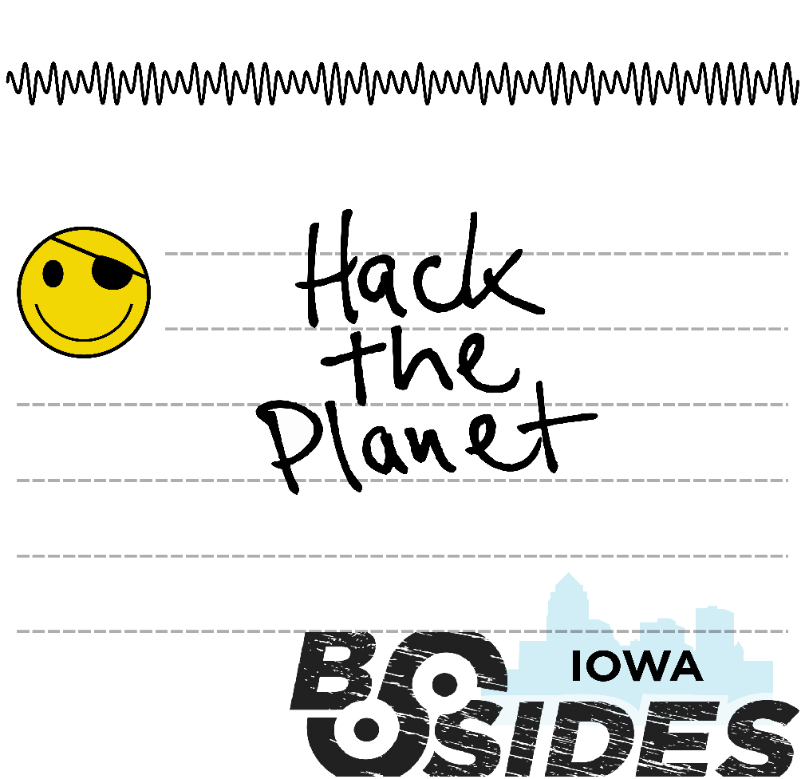

# Identificaiton
This challenge can be identified via the ASK wave on the back of the floppy drive lables. 

# Goal
Bring people together.  

# How to Solve:
On each label, there is a small part of the entire flag, which once all four parts of the flag are put together will decode to `SecDSM{You Put Them Together}`

Each Floopy only has one part of the full flag, so in order to solve the entire flag, people must work together to get the other lables and put them all together. 

Correct Ordering of the labels is important
1) `Hack the Planet`
    - `SecDSM{`
1) `Garbage files`
    - `You Put`
1) `5156441001`
    - ` Them T`
1) `Hack All The Things`
    - `ogether}`

# Images
  
  
  
  
